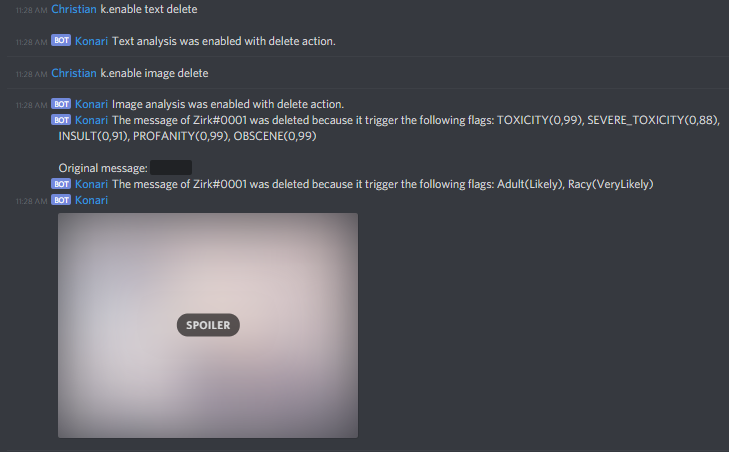

# Konari
A Discord bot that analyse the text and images sent in channels, looking for inappropriate content.

If you want to use this bot, clone it and add a "Keys" folder next to your executable. 
It must contains the following:
 - token.txt: You bot token
 - imageAPI.json: JSON given by Google Vision API
 - perspectiveAPI.json: JSON given by Google Perspective API
 - website.txt (optionnal): website URL and website token (separated by a new line), send report about bot usage
 - url.txt (optionnal): website URL for text report, URL for image report, token (separated by a new line), send report about analysed text/image

